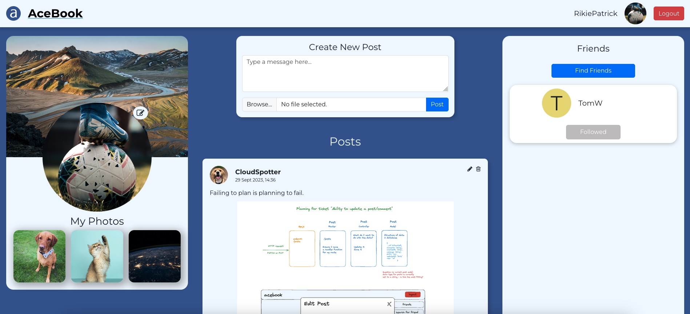

# Acebook - Team Air



[Check it out](https://acebook-team-air.netlify.app/)

In this group project we were tasked with taking on an existing codebase for a social media app "Acebook" and extending and improving on both the frontend and backend of the app to include new features.

A significant part of the work included familiairising ourselves with the codebase we inherited and learning and implementing new languages and frameworks within a timeframe of two weeks.

We also focused heavily on adding styling to make the app more interactive and "user friendly".

## Our Team

* **[Ami Day](https://github.com/ami-day)**
* **[Khalifa Fadel](https://github.com/kmf0208)**
* **[Rikie Patrick](https://github.com/1sAndZeros)**
* **[Cloud Spotter](https://github.com/cloud-spotter)**
* **[Tom Whelan](https://github.com/TWhela)**

## Tech stack

**Frontend:**


**Backend:**
  

## Card wall

[Trello Board can be found here](https://trello.com/b/BxeQZLmW/team-air-acebook-project)

## Quickstart

### Set up your project

1. Fork this repository
2. Clone your fork to your local machine
3. Install Node.js dependencies for both the `frontend` and `api` directories.

   ```bash
   cd api
   npm install
   cd ../frontend
   npm install
   ```

4. Install an ESLint plugin for your editor. For example: [`linter-eslint`](https://github.com/AtomLinter/linter-eslint) for Atom.

5. Install MongoDB

   ```bash
   brew tap mongodb/brew
   brew install mongodb-community@5.0
   ```

6. Start MongoDB

   ```bash
   brew services start mongodb-community@5.0
   ```

7. Setup environment variables

   Copy the .env.example file and rename .env  
   update the relevent variable values
   ensure the JWT secret is the same on the frontend as the api

### Start the server

1. Start the server application (in the `api` directory)

   ```bash
   cd api
   npm run dev
   ```

2. Start the front end application (in the `frontend` directory)

   In a new terminal session...

   ```bash
   cd frontend
   npm start
   ```

You should now be able to open your browser and go to `http://localhost:3000/signup` to create a new user.

Then, after signing up, you should be able to log in by going to `http://localhost:3000/login`.

After logging in, you won't see much but you can create posts using PostMan and they should then show up in the browser if you refresh the page.

### How to run automated tests

The automated tests run by sending actual HTTP requests to the API. Therefore, before anything, you'll need to start the backend server in test mode (so that it connects to the test DB).

```bash
cd api
JWT_SECRET=f6d278bb34e1d0e146a80b16ec254c05 npm run start:test
```

You should leave this running in a terminal.

Then, you can either run tests for the backend or the frontend following the steps below.

#### Running tests for the backend

Run the tests in a new terminal session:

   ```bash
   # Make sure you're in the api directory
   cd api
   JWT_SECRET=f6d278bb34e1d0e146a80b16ec254c05 npm run test
   ```

#### Running tests for the frontend

Start the front end in a new terminal session

   ```bash
   # Make sure you're in the frontend directory
   cd frontend
   JWT_SECRET=f6d278bb34e1d0e146a80b16ec254c05 npm start
   ```

Then run the tests in a new terminal session

   ```bash
   # Make sure you're in the frontend directory
   cd frontend
   JWT_SECRET=f6d278bb34e1d0e146a80b16ec254c05 npm run test
   ```

## MongoDB Connection Errors?

Some people occasionally experience MongoDB connection errors when running the tests or trying to use the application. Here are some tips which might help resolve such issues.

* Check that MongoDB is installed using `mongo --version`
* Check that it's running using `brew services list`